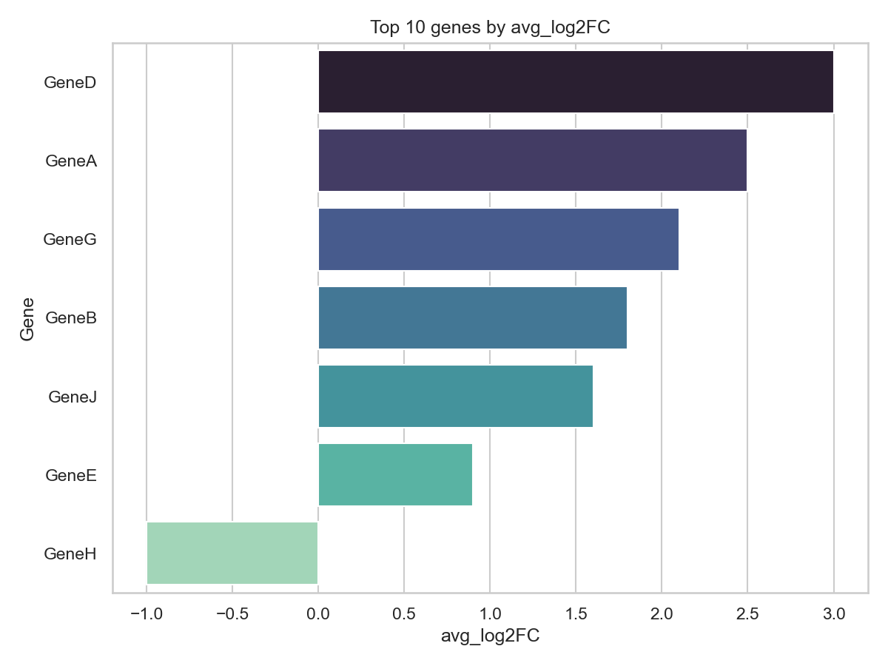
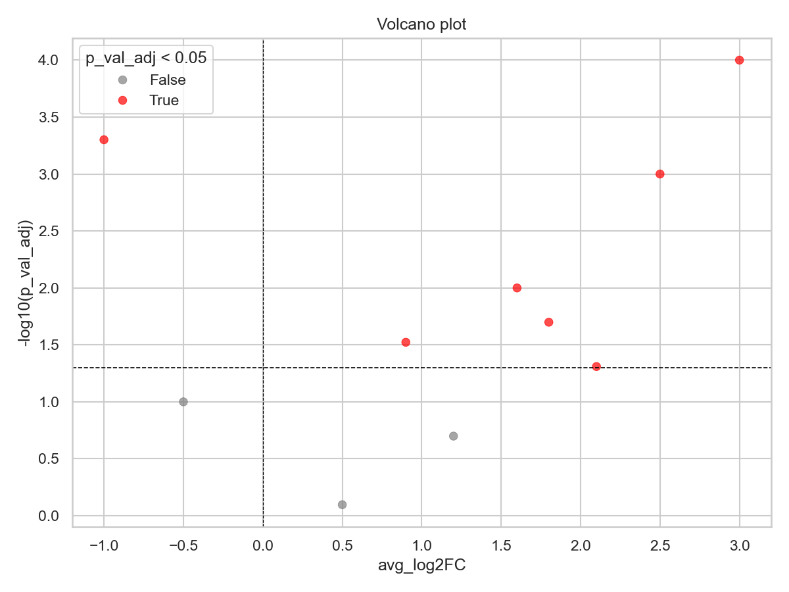
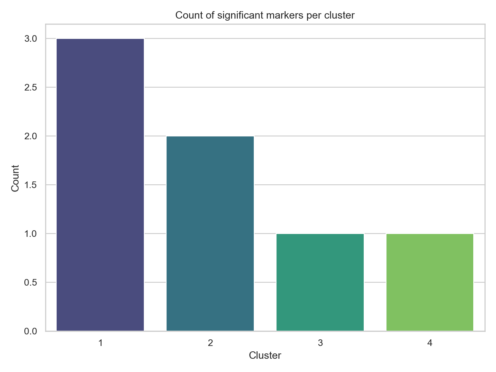

# Gonads ECs Marker Dataset (day08)

This folder contains analysis for a set of vascular endothelial cell (EC) marker genes
derived from gonad single-cell RNA-seq data. The input CSV (`gonads_ecs_sig_markers.xlsx - Sheet 1.csv`)
contains differential expression results (e.g. `gene`, `avg_log2FC`, `p_val_adj`, `cluster`).

The data are linked to the study available at: https://elifesciences.org/articles/76014 — please cite
the original eLife paper when using these data.

Use the provided script `day08/ec_marker_analysis.py` to filter significant markers
(p_val_adj < 0.05), compute top markers per cluster, produce plots, and save a
summary CSV `day08/top_markers_summary.csv`.

Plots (generated by the script and saved in this folder)

- **Top 10 Genes (bar plot)**

	

	Bar plot showing the top 10 upregulated genes by `avg_log2FC` (highest to lowest).

- **Volcano Plot**

	

	Volcano plot of `avg_log2FC` vs `-log10(p_val_adj)`, with significant genes (p_val_adj < 0.05) highlighted.

- **Cluster Distribution (count plot)**

	

	Count plot showing number of significant marker genes per `cluster` (p_val_adj < 0.05).

Run example:
```
python day08/ec_marker_analysis.py "gonads_ecs_sig_markers.xlsx - Sheet 1.csv"
```


